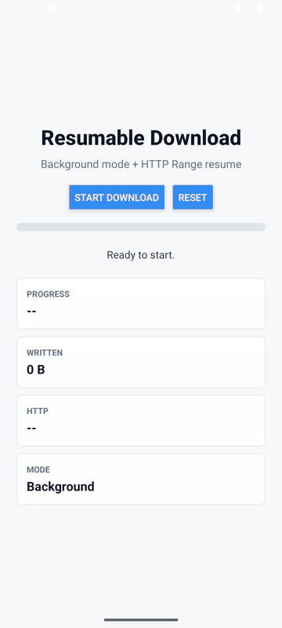
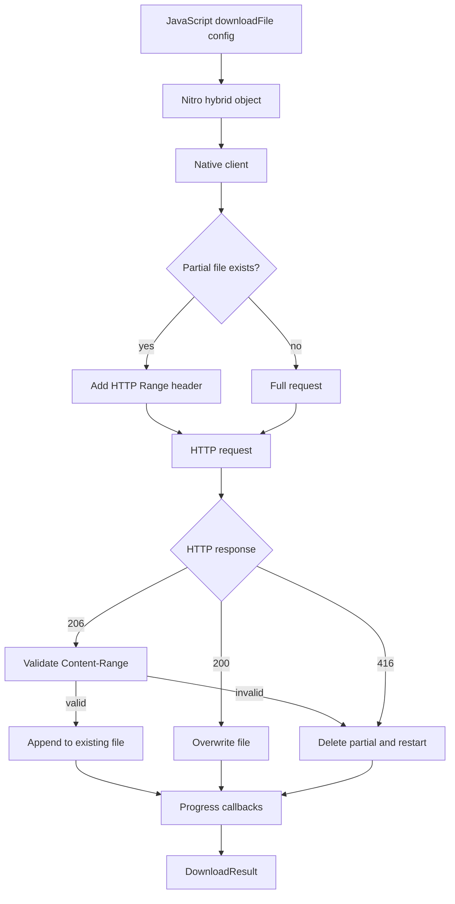

# react-native-client **Native HTTP downloads for React Native**

[](LICENSE)
[](https://developer.android.com)
[](https://developer.apple.com/ios)
[](https://nitro.margelo.com)

`react-native-client` is a native HTTP client for React Native apps that need to download large files without moving bytes through the JavaScript bridge.

The current public API is focused on direct-to-file downloads: native streaming, progress callbacks, resumable HTTP Range requests, background-friendly execution, and safe recovery from partial files. It was built for apps that need to fetch large local assets such as AI models, media packs, offline datasets, and cache warmups.

The project is intended to grow into a broader HTTP client. Today, the stable surface is `downloadFile`.

## Demo



The demo was recorded from the Android example app with `adb screenrecord`, then converted to a sped-up GIF. It starts a native background download, sends the app to the launcher, returns to the same in-flight transfer, force-stops the app, then relaunches and resumes from the partial file with HTTP `206 Partial Content`.

Force-close recovery in the demo works by re-calling the same request on app startup with the same `toFile` and `resumable: true`. The library handles the partial-file resume; it does not yet expose a persistent task registry.

## Features

- **Native engines**: Uses OkHttp on Android and URLSession on iOS.
- **Direct-to-file streaming**: Writes response bytes to disk on the native side.
- **Progress callbacks**: Reports bytes written and total length without transferring file data through JavaScript.
- **HTTP Range resume**: Sends `Range: bytes=<existing-size>-` when a partial file exists.
- **Content-Range validation**: Appends only when `206 Partial Content` matches the existing file size.
- **Safe restart fallback**: Deletes the partial file and restarts cleanly when a server ignores or rejects resume metadata.
- **Background mode**: Uses an Android foreground service and iOS background URLSession.
- **Nitro bridge**: Exposes a typed TypeScript API through Nitro Modules.

## Pipeline



When `resumable` is enabled, the client checks the existing file size and sends `Range: bytes=<size>-`. It only appends if the server returns a valid `206 Partial Content` response with matching `Content-Range`. If the server returns `200 OK`, `416 Range Not Satisfiable`, or invalid range metadata, the partial file is discarded and the client restarts a clean full download.

## Requirements

- React Native app with Nitro Modules installed
- `react-native-nitro-modules >=0.35.0 <0.36.0`
- Android autolinking for normal React Native apps
- CocoaPods install for iOS apps

## Install

```bash
npm install react-native-client react-native-nitro-modules
```

```bash
yarn add react-native-client react-native-nitro-modules
```

```bash
bun add react-native-client react-native-nitro-modules
```

For iOS:

```bash
cd ios
pod install
```

Android does not need extra setup in a normal React Native app. Gradle autolinking handles the native module.

## Usage

Basic direct-to-file download:

```ts
import { downloadFile, documentDirectoryPath } from 'react-native-client'

const result = await downloadFile({
  fromUrl: 'https://example.com/model.gguf',
  toFile: `${documentDirectoryPath}/model.gguf`,
})

console.log(result.statusCode, result.bytesWritten)
```

Download with progress:

```ts
await downloadFile({
  fromUrl: 'https://example.com/large-file.bin',
  toFile: `${documentDirectoryPath}/large-file.bin`,
  begin: (statusCode, contentLength) => {
    console.log('started', statusCode, contentLength)
  },
  onProgress: (bytesWritten, contentLength) => {
    if (contentLength > 0) {
      console.log(`${Math.round((bytesWritten / contentLength) * 100)}%`)
    }
  },
})
```

Resumable background download:

```ts
await downloadFile({
  fromUrl: 'https://example.com/model.gguf',
  toFile: `${documentDirectoryPath}/model.gguf`,
  resumable: true,
  background: true,
  connectionTimeout: 30000,
  readTimeout: 30000,
  onProgress: (bytesWritten, contentLength) => {
    console.log(bytesWritten, contentLength)
  },
})
```

Resume after app relaunch:

```ts
const modelPath = `${documentDirectoryPath}/model.gguf`

// On startup, call the same request again. If modelPath already contains
// partial bytes, the native client will request only the missing range.
await downloadFile({
  fromUrl: modelUrl,
  toFile: modelPath,
  resumable: true,
  background: true,
})
```

## API

### `downloadFile(config): Promise<DownloadResult>`

Downloads an HTTP or HTTPS URL to an absolute native file path.

### `documentDirectoryPath`

Native document directory path for the current app.

### `DownloadConfig`

| Property | Type | Required | Notes |
|---|---:|:---:|---|
| `fromUrl` | `string` | Yes | HTTP or HTTPS URL |
| `toFile` | `string` | Yes | Absolute native file path |
| `resumable` | `boolean` | No | Enables `Range` resume behavior |
| `background` | `boolean` | No | Uses foreground service on Android and background URLSession on iOS |
| `discretionary` | `boolean` | No | iOS background sessions only |
| `connectionTimeout` | `number` | No | Milliseconds |
| `readTimeout` | `number` | No | Android only at the moment |
| `onProgress` | `(bytesWritten, contentLength) => void` | No | Called periodically while downloading |
| `begin` | `(statusCode, contentLength) => void` | No | Called when the request begins |

### `DownloadResult`

| Property | Type | Notes |
|---|---:|---|
| `statusCode` | `number` | Final HTTP status code |
| `bytesWritten` | `number` | Final file size written to disk |

## Platform Behavior

| Capability | Android | iOS |
|---|---|---|
| Native engine | OkHttp | URLSession |
| Foreground file download | Yes | Yes |
| Progress callbacks | Yes | Yes |
| Resume with `Range` | Yes | Yes |
| `Content-Range` validation | Yes | Yes |
| Background mode | Foreground service | Background URLSession |
| Resume after relaunch | Re-call same request | Re-call same request |
| Persistent task registry | Not yet | Not yet |

## Recording the Demo

The development example app lives outside this package during local development. To refresh the README recording with a connected device or running emulator:

```bash
docs/record-android-demo.sh
```

The script starts Metro for the sibling example app, installs the debug APK, uses `adb screenrecord`, starts the download, sends the app home, returns to the app, force-stops it, relaunches it, pulls the recording into `docs/demo.mp4`, and creates a README-sized `docs/demo.gif` with `ffmpeg`.

Useful overrides:

```bash
EXAMPLE_DIR=../react-native-client-example START_METRO=0 INSTALL_APK=0 RECORD_SECONDS=40 GIF_SPEED=2.5 docs/record-android-demo.sh
```

## Source Layout

```text
src/
  index.ts                    TypeScript entrypoint
  specs/Client.nitro.ts       Nitro API definition

android/
  src/main/java/.../Client.kt Native Android implementation
  src/main/java/.../DownloadService.kt
  src/main/cpp/               Nitro Android adapter

ios/
  Client.swift                Native iOS implementation

nitrogen/generated/           Generated Nitro bindings
docs/
  demo.gif                    README recording
  record-android-demo.sh      Android recording helper
```

Native integration is tested through a consuming React Native app. In this workspace, the local Android verification command is:

```bash
cd ../react-native-client-example/android
ANDROID_HOME=/home/mzkux/Android/Sdk ANDROID_SDK_ROOT=/home/mzkux/Android/Sdk ./gradlew :app:assembleDebug
```

## Development

```bash
bun install
bun run typecheck
bun run lint-ci
npm pack --dry-run
```

Regenerate Nitro bindings after changing `src/specs/*.nitro.ts`:

```bash
bun run specs
```

## Development Notes

- The first stable API is file download. General request/response APIs are planned but not exposed yet.
- Background mode keeps active work on native platform primitives.
- Resume after app relaunch requires the app to call the same download again with the same `toFile` and `resumable: true`.
- Android `readTimeout` is implemented; iOS currently supports `connectionTimeout` through URLSession request timeout configuration.
- The package does not yet expose task IDs, cancellation, a persistent task registry, checksums, or uploads.

## Contributing

Contributions are welcome.

### Areas to Improve

1. Add task IDs and cancellation.
2. Add a persistent background task registry.
3. Add request headers and response metadata.
4. Add checksum verification.
5. Add upload support.
6. Expand into general request/response APIs beyond file download.

### Style

- Keep native streaming logic explicit and easy to audit.
- Prefer platform-native HTTP behavior over JavaScript-side file buffering.
- Validate resume metadata before appending to a partial file.
- Avoid unrelated refactors when changing one part of the client.

## License

MIT. See [LICENSE](LICENSE) for the full text.
